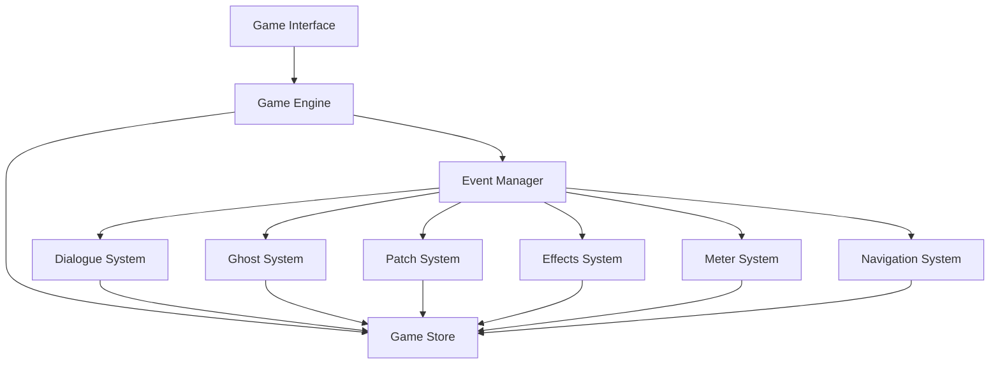

# Gameplay Integration Design

## Overview

This design document outlines the architecture for integrating all gameplay systems into a cohesive, playable haunted debugging game. The integration transforms the current test interface into a fully functional game that orchestrates dialogue, ghost encounters, patch generation, effects, and meter systems through a unified game engine.

## Architecture

### Core Architecture Pattern

The system follows a **Coordinated Component Architecture** where:
- A central `GameEngine` orchestrates all subsystems
- Individual systems maintain their autonomy while participating in coordinated workflows
- An event-driven communication pattern enables loose coupling between components
- State management flows through a unified store with system-specific slices



### System Integration Layers

1. **Presentation Layer**: React components that render game interface
2. **Orchestration Layer**: Game engine that coordinates system interactions
3. **Business Logic Layer**: Individual gameplay systems (dialogue, ghosts, etc.)
4. **State Management Layer**: Zustand store with system-specific slices
5. **Persistence Layer**: Local storage and session management

## Components and Interfaces

### 1. Game Engine

**Purpose**: Central coordinator that orchestrates all gameplay systems and manages the overall game flow.

**Key Responsibilities**:
- Initialize and configure all subsystems
- Coordinate cross-system interactions
- Handle game state transitions
- Manage event propagation between systems
- Provide unified error handling and recovery

**Interface**:
```typescript
interface GameEngine {
  initialize(): Promise<void>;
  startEncounter(ghostId: string): Promise<EncounterSession>;
  processPlayerAction(action: PlayerAction): Promise<ActionResult>;
  navigateToRoom(roomId: string): Promise<NavigationResult>;
  saveGameState(): Promise<void>;
  loadGameState(): Promise<GameState>;
  shutdown(): Promise<void>;
}
```

### 2. Encounter Orchestrator

**Purpose**: Manages the complete ghost encounter workflow from initiation to resolution.

**Key Responsibilities**:
- Coordinate dialogue sessions with patch generation
- Apply consequences through effects and meter systems
- Track encounter progress and outcomes
- Handle encounter state persistence

**Interface**:
```typescript
interface EncounterOrchestrator {
  startEncounter(ghost: Ghost, context: GameContext): Promise<EncounterSession>;
  processDialogueChoice(sessionId: string, choice: DialogueChoice): Promise<DialogueResult>;
  generatePatchOptions(intent: string, ghost: Ghost): Promise<PatchOption[]>;
  applyPatchChoice(patchId: string, action: PatchAction): Promise<PatchResult>;
  completeEncounter(sessionId: string): Promise<EncounterOutcome>;
}
```

### 3. Effect Coordinator

**Purpose**: Synchronizes visual and audio effects with gameplay events across all systems.

**Key Responsibilities**:
- Listen for game events that should trigger effects
- Coordinate effect timing and intensity
- Manage effect conflicts and priorities
- Apply accessibility constraints to all effects

**Interface**:
```typescript
interface EffectCoordinator {
  registerEffectTrigger(event: GameEvent, effects: EffectSet): void;
  processGameEvent(event: GameEvent): Promise<void>;
  setAccessibilityMode(settings: AccessibilitySettings): void;
  clearAllEffects(): void;
}
```

### 4. Navigation Manager

**Purpose**: Handles room transitions, unlocking, and contextual loading of room-specific content.

**Key Responsibilities**:
- Manage room unlock conditions and progression
- Load room-specific ghosts and assets
- Handle room transition animations and effects
- Maintain room state and history

**Interface**:
```typescript
interface NavigationManager {
  getCurrentRoom(): Room;
  getAvailableRooms(): Room[];
  canNavigateToRoom(roomId: string): boolean;
  navigateToRoom(roomId: string): Promise<NavigationResult>;
  unlockRoom(roomId: string, condition: UnlockCondition): void;
}
```

### 5. Session Manager

**Purpose**: Manages game sessions, persistence, and progress tracking across multiple play sessions.

**Key Responsibilities**:
- Handle game session lifecycle
- Persist and restore game state
- Track learning progress and analytics
- Manage multiple save slots if needed

**Interface**:
```typescript
interface SessionManager {
  createSession(userId?: string): GameSession;
  saveSession(session: GameSession): Promise<void>;
  loadSession(sessionId: string): Promise<GameSession>;
  getSessionHistory(): GameSession[];
  exportProgress(): ProgressExport;
}
```

## Data Models

### Enhanced Game State

```typescript
interface EnhancedGameState extends GameState {
  // Active gameplay sessions
  activeEncounters: Record<string, EncounterSession>;
  
  // System states
  effectsState: EffectsState;
  navigationState: NavigationState;
  
  // Progress tracking
  completedEncounters: CompletedEncounter[];
  unlockedContent: UnlockedContent[];
  learningProgress: LearningProgress;
  
  // Settings and preferences
  playerSettings: PlayerSettings;
  accessibilitySettings: AccessibilitySettings;
}
```

### Encounter Session

```typescript
interface EncounterSession {
  id: string;
  ghostId: string;
  roomId: string;
  startTime: Date;
  currentPhase: EncounterPhase;
  dialogueSession?: DialogueSession;
  generatedPatches: PatchOption[];
  appliedPatches: AppliedPatch[];
  consequences: Consequence[];
  isComplete: boolean;
}
```

### Game Event System

```typescript
interface GameEvent {
  type: GameEventType;
  timestamp: Date;
  source: string;
  data: Record<string, any>;
  priority: EventPriority;
}

enum GameEventType {
  ENCOUNTER_STARTED = 'encounter_started',
  DIALOGUE_CHOICE_MADE = 'dialogue_choice_made',
  PATCH_APPLIED = 'patch_applied',
  METER_CHANGED = 'meter_changed',
  ROOM_ENTERED = 'room_entered',
  ACHIEVEMENT_UNLOCKED = 'achievement_unlocked',
  CRITICAL_EVENT = 'critical_event'
}
```

## Error Handling

### Graceful Degradation Strategy

1. **System Isolation**: If one system fails, others continue operating
2. **Fallback Modes**: Simplified versions of features when full functionality fails
3. **User Communication**: Clear error messages that don't break immersion
4. **Recovery Mechanisms**: Automatic retry and manual recovery options

### Error Handling Hierarchy

```typescript
interface ErrorHandler {
  handleSystemError(system: string, error: Error): ErrorRecovery;
  handleUserError(action: string, error: Error): UserFeedback;
  handleCriticalError(error: Error): CriticalRecovery;
}
```

## Testing Strategy

### Integration Testing Approach

1. **System Integration Tests**: Verify cross-system communication and coordination
2. **Workflow Tests**: Test complete user journeys from encounter start to completion
3. **State Consistency Tests**: Ensure game state remains consistent across system interactions
4. **Performance Tests**: Verify system performance under various load conditions
5. **Accessibility Tests**: Validate accessibility features across all systems

### Test Scenarios

1. **Complete Encounter Flow**: Start encounter → dialogue → patch generation → application → effects → completion
2. **Room Navigation**: Enter room → encounter ghosts → complete objectives → unlock new room
3. **Error Recovery**: System failure during encounter → graceful degradation → recovery
4. **Accessibility Mode**: Enable accessibility settings → verify effect modifications → test alternative feedback
5. **Session Persistence**: Play game → save state → reload → verify continuity

## Performance Considerations

### Optimization Strategies

1. **Lazy Loading**: Load system components only when needed
2. **Effect Batching**: Batch multiple effects to reduce rendering overhead
3. **State Optimization**: Use selective state updates to minimize re-renders
4. **Asset Management**: Preload critical assets, lazy load secondary content
5. **Memory Management**: Clean up completed encounters and unused resources

### Performance Monitoring

```typescript
interface PerformanceMonitor {
  trackSystemPerformance(system: string, metrics: PerformanceMetrics): void;
  getPerformanceReport(): PerformanceReport;
  optimizeForDevice(deviceCapabilities: DeviceCapabilities): OptimizationSettings;
}
```

## Security Considerations

### Data Protection

1. **Local Storage Security**: Encrypt sensitive game progress data
2. **Input Validation**: Validate all user inputs to prevent injection attacks
3. **Asset Integrity**: Verify asset integrity to prevent tampering
4. **Privacy Protection**: Minimize data collection and provide clear privacy controls

### Security Implementation

```typescript
interface SecurityManager {
  encryptGameData(data: GameState): EncryptedData;
  decryptGameData(encrypted: EncryptedData): GameState;
  validateUserInput(input: UserInput): ValidationResult;
  sanitizeContent(content: string): string;
}
```

## Deployment Strategy

### Progressive Enhancement

1. **Core Functionality**: Basic game mechanics work without advanced features
2. **Enhanced Features**: Advanced effects and interactions for capable devices
3. **Accessibility Layer**: Full accessibility support as a core feature, not an add-on
4. **Performance Scaling**: Automatic performance adjustment based on device capabilities

### Rollout Plan

1. **Phase 1**: Core integration with basic encounter flow
2. **Phase 2**: Enhanced effects and navigation system
3. **Phase 3**: Advanced features and accessibility improvements
4. **Phase 4**: Performance optimization and analytics integration