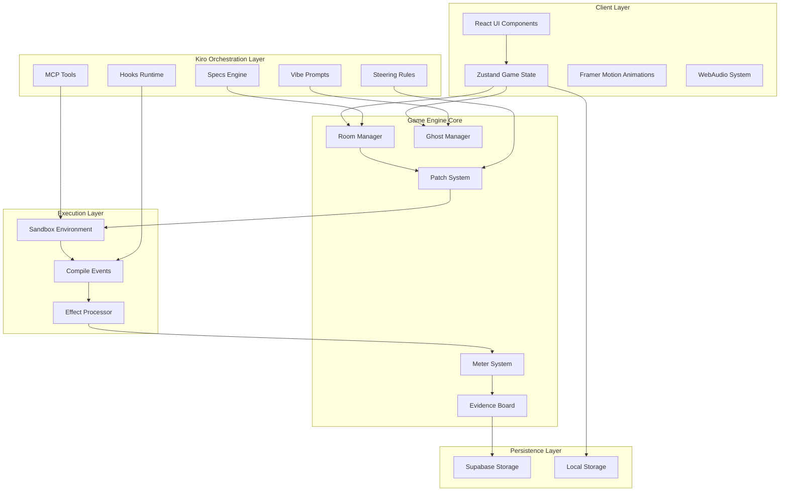

# Design Document

## Overview

The Haunted Debug Game is a browser-based horror experience that transforms debugging into an interactive narrative. Players navigate through a cursed AI repository, conversing with ghosts that represent software smells and applying patches through Kiro-powered interactions. The system demonstrates a reusable adaptive narrative engine suitable for education, onboarding, and incident response training.

The architecture leverages Kiro's complete surface area - specs for canonical definitions, hooks for lifecycle automation, steering for behavioral constraints, vibe for rapid narrative iteration, and MCP tools for concrete capabilities. This creates a living system where the game logic itself is managed through agent orchestration patterns.

## Architecture

### High-Level System Design



### Kiro Integration Architecture

The `.kiro` directory structure serves as the game's configuration and behavior definition system:

- **Specs** (`/specs/game.yaml`, `/specs/ghosts.yaml`, `/specs/rooms.yaml`): Define entities, transitions, and canonical game rules
- **Hooks** (`/hooks/*.ts`): Provide lifecycle automation for room entry, patch planning, compilation, and meter changes
- **Steering** (`/steering/*.md`): Enforce tone consistency, ethical constraints, and design language
- **Vibe** (`/vibe/*.md`): Enable rapid iteration on narrative beats and dialogue generation
- **MCP Tools** (`/mcp/*.ts`): Expose concrete capabilities for diff application, linting, shader generation, SFX queuing, lore search, and safe execution

## Components and Interfaces

### Core Game Engine Components

#### Room Manager
```typescript
interface RoomManager {
  currentRoom: Room;
  availableRooms: Room[];
  transitionTo(roomKey: string): Promise<TransitionResult>;
  checkTransitionConditions(from: string, to: string): boolean;
  executeRoomEntry(room: Room): Promise<void>;
}

interface Room {
  key: string;
  title: string;
  entryText: string;
  solved: boolean;
  ghosts: Ghost[];
  onEnter?: string; // Hook reference
  goals: string[];
}
```

#### Ghost Manager
```typescript
interface GhostManager {
  getGhostsByRoom(roomKey: string): Ghost[];
  generateDialogue(ghost: Ghost, context: GameContext): Promise<string>;
  createPatchPlan(ghost: Ghost, playerIntent: string): Promise<PatchPlan>;
}

interface Ghost {
  id: string;
  type: SoftwareSmell;
  severity: number;
  hint: string;
  dialoguePrompts: string[];
  fixPatterns: PatchPattern[];
}

enum SoftwareSmell {
  CircularDependency = "circular_dependency",
  StaleCache = "stale_cache", 
  UnboundedRecursion = "unbounded_recursion",
  PromptInjection = "prompt_injection",
  DataLeak = "data_leak",
  DeadCode = "dead_code",
  RaceCondition = "race_condition",
  MemoryLeak = "memory_leak"
}
```

#### Patch System
```typescript
interface PatchSystem {
  generatePlan(intent: string, ghost: Ghost): Promise<PatchPlan>;
  applyPatch(plan: PatchPlan): Promise<PatchResult>;
  validatePatch(diff: string): ValidationResult;
}

interface PatchPlan {
  diff: string;
  description: string;
  risk: number; // 0.0 to 1.0
  effects: MeterEffects;
  ghostResponse: string;
}

interface PatchResult {
  success: boolean;
  effects: MeterEffects;
  compileEvents: CompileEvent[];
  newDialogue?: string;
}
```

#### Meter System
```typescript
interface MeterSystem {
  stability: number; // 0-100
  insight: number; // 0-100
  applyEffects(effects: MeterEffects): void;
  checkGameOverConditions(): GameOverCondition | null;
}

interface MeterEffects {
  stability: number; // Can be negative
  insight: number; // Can be negative
  description: string;
}

enum GameOverCondition {
  KernelPanic = "kernel_panic", // stability = 0
  MoralInversion = "moral_inversion", // ethics failure
  Victory = "victory" // correct branch merge
}
```

### Kiro Integration Interfaces

#### Hook System
```typescript
interface HookContext {
  gameState: GameState;
  room?: Room;
  ghost?: Ghost;
  patch?: PatchPlan;
  tools: MCPTools;
}

interface GameHooks {
  onRoomEnter(ctx: HookContext): Promise<HookContext>;
  onPatchPlan(ctx: HookContext): Promise<HookContext>;
  onCompile(ctx: HookContext): Promise<HookContext>;
  onMeterChange(ctx: HookContext): Promise<HookContext>;
}
```

#### MCP Tools Interface
```typescript
interface MCPTools {
  diff: {
    apply(diff: string, target: string): Promise<ApplyResult>;
  };
  lint: {
    run(code: string, rules: LintRules): Promise<LintResult>;
  };
  shader: {
    generate(effect: EffectType): Promise<ShaderCode>;
  };
  sfx: {
    queue(sound: SoundEffect): Promise<void>;
  };
  lore: {
    search(query: string): Promise<LoreEntry[]>;
  };
  safe: {
    exec(code: string, context: ExecContext): Promise<ExecResult>;
  };
}
```

## Data Models

### Game State Model
```typescript
interface GameState {
  run: GameRun;
  currentRoom: string;
  meters: {
    stability: number;
    insight: number;
  };
  unlockedRooms: string[];
  evidenceBoard: EvidenceEntry[];
  playerChoices: PlayerChoice[];
}

interface GameRun {
  id: string;
  userId?: string;
  startedAt: Date;
  endedAt?: Date;
  finalStability: number;
  finalInsight: number;
  outcome: GameOutcome;
}

interface EvidenceEntry {
  id: string;
  timestamp: Date;
  type: 'patch_applied' | 'room_entered' | 'ghost_encountered' | 'meter_change';
  description: string;
  context: Record<string, any>;
  effects?: MeterEffects;
}
```

### Content Model
```typescript
interface GameContent {
  rooms: Record<string, Room>;
  ghosts: Record<string, Ghost>;
  lore: Record<string, LoreEntry>;
  transitions: RoomTransition[];
}

interface RoomTransition {
  from: string;
  to: string;
  condition: string; // Evaluated expression
  description: string;
}

interface LoreEntry {
  id: string;
  key: string;
  text: string;
  tags: string[];
  unlockedBy?: string; // Condition for unlock
}
```

## Error Handling

### Sandbox Security
- All player-generated patches are validated through multiple layers before execution
- The sandbox environment uses vm2 or WASM isolation to prevent system access
- Only game-DSL operations are permitted; arbitrary code execution is blocked
- Malformed patches trigger helpful error messages with ghost commentary

### Game State Recovery
- Critical game state is persisted to local storage after each significant action
- Network failures gracefully degrade to offline mode with cached content
- Corrupted save states trigger a recovery flow that preserves progress where possible
- Players can export their evidence board before attempting risky patches

### Performance Safeguards
- Animation frame budgets prevent performance degradation during complex effects
- Large diff previews are truncated with expansion options
- Audio effects are pooled and reused to prevent memory leaks
- Room transitions include loading states for smooth user experience

## Testing Strategy

### Unit Testing
- **Ghost Logic**: Test each software smell's detection and fix generation
- **Meter Calculations**: Verify effect application and game over conditions
- **Patch Validation**: Ensure sandbox security and proper diff parsing
- **Room Transitions**: Validate condition evaluation and state updates

### Integration Testing
- **Kiro Orchestration**: Test hook execution and MCP tool integration
- **Patch Pipeline**: Verify end-to-end flow from intent to compilation
- **State Persistence**: Test save/load functionality across browser sessions
- **Audio/Visual Effects**: Validate timing and performance of animations

### Accessibility Testing
- **Contrast Ratios**: Automated testing for 4.5:1 minimum compliance
- **Keyboard Navigation**: Full game playable without mouse interaction
- **Screen Reader Support**: Proper ARIA labels and semantic markup
- **Reduced Motion**: Alternative animations for motion-sensitive users

### Performance Testing
- **60 FPS Target**: Frame rate monitoring during complex animations
- **Memory Usage**: Leak detection during extended play sessions
- **Load Times**: Room transition and asset loading benchmarks
- **Mobile Compatibility**: Touch interaction and responsive design validation

### Security Testing
- **Sandbox Isolation**: Attempt to break out of execution environment
- **Input Validation**: Test malicious patch content and injection attempts
- **Data Sanitization**: Verify proper handling of user-generated content
- **Network Security**: Validate API endpoint protection and rate limiting

The testing approach emphasizes automated validation where possible, with particular attention to the security-critical sandbox environment and the performance requirements for smooth 60 FPS gameplay.