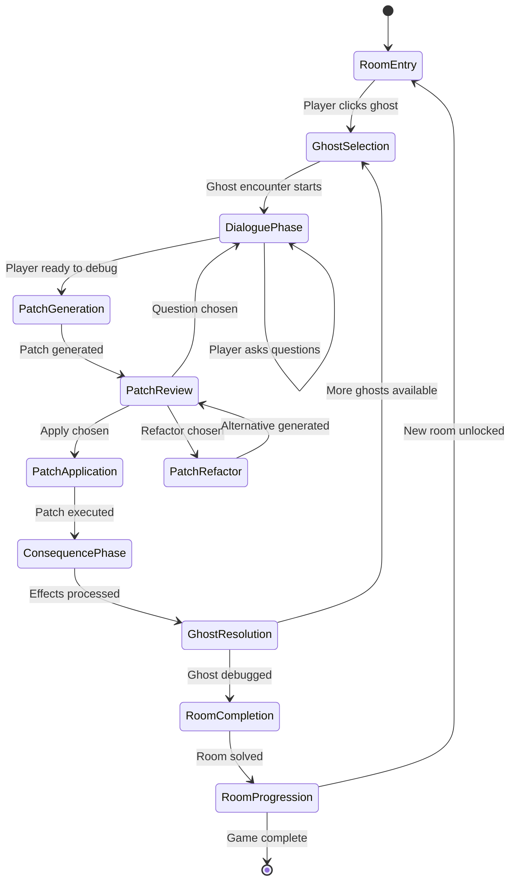
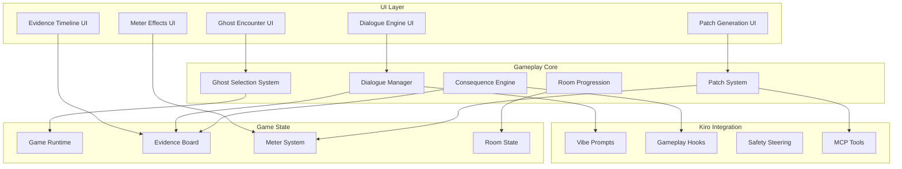

# Design Document

## Overview

The Interactive Gameplay Implementation brings the Haunted Debug Game to life by creating a complete gameplay loop where players encounter ghosts, engage in educational debugging conversations, generate and apply patches, and experience dynamic consequences. This system transforms the existing foundation into a fully playable educational horror experience that teaches debugging skills through immersive interaction.

The design builds upon the existing game engine, asset system, and UI components while adding sophisticated dialogue generation, patch creation, and consequence simulation. The architecture maintains the Kiro orchestration patterns established in the foundation, leveraging specs, hooks, steering, vibe, and MCP tools to create a living, adaptive gameplay experience.

## Architecture

### Interactive Gameplay Flow



### System Architecture



## Components and Interfaces

### Ghost Encounter System

#### Ghost Selection Interface
```typescript
interface GhostSelectionSystem {
  getAvailableGhosts(roomKey: string): EncounterableGhost[];
  startEncounter(ghostId: string): Promise<GhostEncounter>;
  getEncounterState(ghostId: string): EncounterState;
}

interface EncounterableGhost extends Ghost {
  isAvailable: boolean;
  isCompleted: boolean;
  difficultyLevel: number;
  estimatedTime: number;
  prerequisites?: string[];
}

interface GhostEncounter {
  id: string;
  ghost: Ghost;
  state: EncounterState;
  dialogue: DialogueSession;
  patches: PatchSession[];
  startedAt: Date;
  completedAt?: Date;
}

enum EncounterState {
  NotStarted = 'not_started',
  InDialogue = 'in_dialogue',
  GeneratingPatch = 'generating_patch',
  ReviewingPatch = 'reviewing_patch',
  ApplyingPatch = 'applying_patch',
  Completed = 'completed',
  Failed = 'failed'
}
```

#### Dialogue Engine
```typescript
interface DialogueEngine {
  startDialogue(ghost: Ghost, context: GameContext): Promise<DialogueSession>;
  processPlayerInput(sessionId: string, input: string): Promise<DialogueResponse>;
  generateEducationalContent(ghost: Ghost, topic: string): Promise<string>;
  getAvailableQuestions(sessionId: string): string[];
}

interface DialogueSession {
  id: string;
  ghostId: string;
  messages: DialogueMessage[];
  context: DialogueContext;
  educationalTopics: string[];
  isReadyForDebugging: boolean;
}

interface DialogueMessage {
  id: string;
  speaker: 'player' | 'ghost';
  content: string;
  timestamp: Date;
  type: 'question' | 'explanation' | 'hint' | 'story';
  metadata?: Record<string, any>;
}

interface DialogueContext {
  ghostType: SoftwareSmell;
  roomContext: string;
  playerKnowledge: string[];
  previousEncounters: string[];
  currentMeterLevels: MeterLevels;
}
```

### Patch Generation System

#### Patch Generation Interface
```typescript
interface PatchGenerationSystem {
  generatePatch(intent: string, context: PatchContext): Promise<GeneratedPatch>;
  generateAlternative(originalPatch: GeneratedPatch): Promise<GeneratedPatch>;
  validatePatch(patch: GeneratedPatch): ValidationResult;
  calculateRiskScore(patch: GeneratedPatch): number;
}

interface PatchContext {
  ghost: Ghost;
  dialogueHistory: DialogueMessage[];
  playerIntent: string;
  codeContext: string;
  roomContext: string;
  playerSkillLevel: number;
}

interface GeneratedPatch {
  id: string;
  diff: string;
  description: string;
  explanation: string;
  riskScore: number; // 0.0 to 1.0
  expectedEffects: MeterEffects;
  educationalNotes: string[];
  alternatives?: string[];
  ghostResponse: string;
}

interface PatchSession {
  id: string;
  ghostEncounterId: string;
  playerIntent: string;
  generatedPatches: GeneratedPatch[];
  selectedPatch?: GeneratedPatch;
  applicationResult?: PatchApplicationResult;
  createdAt: Date;
}
```

#### Player Choice Handler
```typescript
interface PlayerChoiceHandler {
  presentChoices(patch: GeneratedPatch): PlayerChoiceOptions;
  processChoice(choice: PlayerChoice): Promise<ChoiceResult>;
  trackDecisionPattern(playerId: string, choice: PlayerChoice): void;
}

interface PlayerChoiceOptions {
  apply: {
    label: string;
    description: string;
    riskLevel: 'low' | 'medium' | 'high';
    expectedOutcome: string;
  };
  refactor: {
    label: string;
    description: string;
    alternativeApproach: string;
    tradeoffs: string[];
  };
  question: {
    label: string;
    description: string;
    availableQuestions: string[];
    educationalValue: string;
  };
}

interface PlayerChoice {
  type: 'apply' | 'refactor' | 'question';
  patchId: string;
  timestamp: Date;
  reasoning?: string;
  questionAsked?: string;
}

interface ChoiceResult {
  success: boolean;
  effects: MeterEffects;
  consequences: GameConsequence[];
  newDialogue?: string;
  unlockedContent?: string[];
}
```

### Consequence and Effects System

#### Compile Event Processor
```typescript
interface CompileEventProcessor {
  executePatches(patch: GeneratedPatch): Promise<PatchApplicationResult>;
  simulateCompilation(patch: GeneratedPatch): CompilationSimulation;
  processConsequences(result: PatchApplicationResult): GameConsequence[];
  triggerVisualEffects(consequences: GameConsequence[]): void;
}

interface PatchApplicationResult {
  success: boolean;
  compilationOutput: string;
  runtimeEffects: RuntimeEffect[];
  meterChanges: MeterEffects;
  unlockedContent: string[];
  triggeredEvents: CompileEvent[];
}

interface CompilationSimulation {
  wouldCompile: boolean;
  warnings: string[];
  errors: string[];
  performanceImpact: number;
  securityIssues: string[];
  codeQualityScore: number;
}

interface GameConsequence {
  type: 'meter_change' | 'visual_effect' | 'audio_cue' | 'unlock_content' | 'trigger_event';
  severity: 'minor' | 'moderate' | 'major' | 'critical';
  description: string;
  effects: Record<string, any>;
  duration?: number;
}
```

#### Dynamic Meter System
```typescript
interface DynamicMeterSystem extends MeterSystem {
  animateChange(effects: MeterEffects): Promise<void>;
  calculateVisualEffects(currentLevels: MeterLevels): VisualEffectSet;
  calculateAudioEffects(currentLevels: MeterLevels): AudioEffectSet;
  checkCriticalThresholds(levels: MeterLevels): CriticalEvent[];
}

interface VisualEffectSet {
  screenDistortion: number; // 0.0 to 1.0
  colorShift: ColorShiftEffect;
  glitchIntensity: number;
  overlayEffects: OverlayEffect[];
}

interface AudioEffectSet {
  heartbeatIntensity: number; // 0.0 to 1.0
  whisperVolume: number;
  ambientTension: number;
  effectTriggers: AudioTrigger[];
}

interface CriticalEvent {
  type: 'stability_warning' | 'insight_breakthrough' | 'system_failure' | 'moral_conflict';
  threshold: number;
  message: string;
  effects: GameConsequence[];
}
```

### Evidence and Progression System

#### Evidence Timeline
```typescript
interface EvidenceTimeline {
  recordEncounter(encounter: GhostEncounter): void;
  recordPatchApplication(session: PatchSession, result: PatchApplicationResult): void;
  recordDecision(choice: PlayerChoice, outcome: ChoiceResult): void;
  getTimeline(): EvidenceEntry[];
  exportReport(): PostMortemReport;
  searchEntries(query: string): EvidenceEntry[];
}

interface EvidenceEntry {
  id: string;
  timestamp: Date;
  type: 'encounter' | 'patch' | 'decision' | 'consequence' | 'progression';
  title: string;
  description: string;
  context: Record<string, any>;
  outcome: 'success' | 'failure' | 'partial' | 'pending';
  learningPoints: string[];
  relatedEntries: string[];
}

interface PostMortemReport {
  gameRunId: string;
  playerStats: PlayerStatistics;
  timeline: EvidenceEntry[];
  learningOutcomes: LearningOutcome[];
  recommendations: string[];
  exportedAt: Date;
}
```

#### Room Progression System
```typescript
interface RoomProgressionSystem {
  checkUnlockConditions(currentRoom: string): string[];
  unlockRoom(roomKey: string): Promise<RoomUnlockResult>;
  calculateRoomDifficulty(roomKey: string, playerStats: PlayerStatistics): number;
  getProgressionPath(): RoomProgressionPath;
}

interface RoomUnlockResult {
  success: boolean;
  unlockedRoom: Room;
  unlockMessage: string;
  newChallenges: Ghost[];
  difficultyAdjustment: number;
}

interface RoomProgressionPath {
  currentRoom: string;
  completedRooms: string[];
  availableRooms: string[];
  lockedRooms: RoomLockInfo[];
  estimatedCompletion: number; // percentage
}

interface RoomLockInfo {
  roomKey: string;
  requirements: UnlockRequirement[];
  estimatedDifficulty: number;
  recommendedPreparation: string[];
}
```

## Data Models

### Enhanced Game State
```typescript
interface InteractiveGameState extends GameState {
  activeEncounter?: GhostEncounter;
  dialogueSessions: Record<string, DialogueSession>;
  patchSessions: Record<string, PatchSession>;
  evidenceTimeline: EvidenceEntry[];
  roomProgression: RoomProgressionPath;
  playerStatistics: PlayerStatistics;
  audioSettings: AudioSettings;
  visualSettings: VisualSettings;
}

interface PlayerStatistics {
  encountersStarted: number;
  encountersCompleted: number;
  patchesApplied: number;
  patchesRefactored: number;
  questionsAsked: number;
  averageRiskTolerance: number;
  learningTopicsMastered: string[];
  preferredDebuggingStyle: DebuggingStyle;
}

enum DebuggingStyle {
  Cautious = 'cautious',      // Prefers low-risk patches and lots of questions
  Aggressive = 'aggressive',   // Applies high-risk patches quickly
  Analytical = 'analytical',   // Focuses on understanding before acting
  Experimental = 'experimental' // Tries multiple approaches
}
```

### Content Enhancement
```typescript
interface EnhancedGhost extends Ghost {
  dialoguePrompts: DialoguePrompt[];
  educationalContent: EducationalContent;
  patchPatterns: PatchPattern[];
  difficultyScaling: DifficultyScaling;
  visualEffects: GhostVisualEffects;
}

interface DialoguePrompt {
  trigger: string;
  response: string;
  educationalValue: number;
  followUpQuestions: string[];
  unlockConditions?: string[];
}

interface EducationalContent {
  conceptExplanation: string;
  realWorldExamples: string[];
  commonMistakes: string[];
  bestPractices: string[];
  furtherReading: string[];
}

interface PatchPattern {
  problemType: string;
  solutionTemplate: string;
  riskFactors: string[];
  alternativeApproaches: string[];
  educationalNotes: string[];
}
```

## Error Handling

### Gameplay Error Recovery
- **Dialogue Failures**: Fallback to pre-written responses with graceful degradation
- **Patch Generation Errors**: Alternative generation methods with simpler approaches
- **Consequence Processing**: Safe defaults that maintain game state consistency
- **Audio/Visual Failures**: Silent degradation with accessibility alternatives

### State Consistency
- **Encounter State Validation**: Ensure encounters can't enter invalid states
- **Meter Boundary Enforcement**: Prevent meter values from exceeding valid ranges
- **Timeline Integrity**: Maintain chronological consistency in evidence records
- **Progress Validation**: Verify room unlocks meet actual completion criteria

### User Experience Protection
```typescript
interface GameplayErrorHandler {
  handleDialogueFailure(sessionId: string, error: Error): DialogueRecovery;
  handlePatchGenerationFailure(context: PatchContext, error: Error): PatchRecovery;
  handleConsequenceFailure(patch: GeneratedPatch, error: Error): ConsequenceRecovery;
  validateGameState(state: InteractiveGameState): ValidationResult;
}

interface DialogueRecovery {
  fallbackResponse: string;
  recoveryActions: string[];
  userMessage?: string;
  continueSession: boolean;
}
```

## Testing Strategy

### Gameplay Testing
- **Encounter Flow Testing**: Validate complete ghost encounter workflows
- **Dialogue System Testing**: Test conversation branching and educational content delivery
- **Patch Generation Testing**: Verify realistic and safe patch creation
- **Consequence Testing**: Ensure meter changes and effects work correctly
- **Progression Testing**: Validate room unlocking and difficulty scaling

### Educational Effectiveness Testing
- **Learning Outcome Validation**: Measure actual debugging skill improvement
- **Content Accuracy Testing**: Verify technical correctness of educational material
- **Engagement Metrics**: Track player attention and completion rates
- **Accessibility Testing**: Ensure educational content is accessible to diverse learners

### Performance Testing
- **Real-time Interaction**: Ensure smooth 60 FPS during active gameplay
- **Memory Management**: Prevent leaks during extended play sessions
- **Audio/Visual Performance**: Validate effect rendering doesn't impact gameplay
- **State Management**: Test large evidence timelines and complex game states

### Integration Testing
```typescript
interface GameplayTestSuite {
  testCompleteEncounter(ghostType: SoftwareSmell): Promise<TestResult>;
  testPatchGenerationFlow(playerIntent: string): Promise<TestResult>;
  testConsequenceChaining(patchSequence: GeneratedPatch[]): Promise<TestResult>;
  testRoomProgression(completionPath: string[]): Promise<TestResult>;
  testEducationalEffectiveness(learningObjectives: string[]): Promise<TestResult>;
}
```

## Implementation Strategy

### Phase 1: Core Interaction Loop
- Implement basic ghost encounter system with simple dialogue
- Create patch generation with pre-defined templates
- Add basic Apply/Refactor/Question choice handling
- Implement immediate meter effects and visual feedback

### Phase 2: Enhanced Dialogue and Education
- Integrate Kiro vibe prompts for dynamic dialogue generation
- Add educational content delivery system
- Implement question-answering capabilities
- Create adaptive difficulty based on player responses

### Phase 3: Advanced Consequences and Progression
- Implement sophisticated compile event processing
- Add room progression with unlock conditions
- Create evidence timeline with export capabilities
- Integrate audio/visual effects system

### Phase 4: Polish and Optimization
- Add comprehensive error handling and recovery
- Implement performance optimizations
- Create accessibility enhancements
- Add analytics and learning outcome tracking

## Kiro Integration Patterns

### Vibe-Driven Dialogue
```typescript
interface VibeIntegration {
  generateGhostDialogue(ghost: Ghost, context: DialogueContext): Promise<string>;
  createEducationalExplanation(topic: string, playerLevel: number): Promise<string>;
  adaptToneForSituation(baseContent: string, situation: GameSituation): Promise<string>;
}
```

### MCP Tool Integration
```typescript
interface MCPGameplayTools {
  patchGenerator: {
    createDiff(intent: string, codeContext: string): Promise<string>;
    validateSafety(diff: string): Promise<ValidationResult>;
    calculateComplexity(diff: string): Promise<number>;
  };
  educationEngine: {
    explainConcept(concept: string, level: string): Promise<string>;
    generateExamples(concept: string): Promise<string[]>;
    assessUnderstanding(responses: string[]): Promise<number>;
  };
  effectProcessor: {
    simulateConsequences(patch: GeneratedPatch): Promise<GameConsequence[]>;
    generateVisualEffects(consequences: GameConsequence[]): Promise<EffectDefinition[]>;
    queueAudioEffects(consequences: GameConsequence[]): Promise<void>;
  };
}
```

### Hook-Driven Events
```typescript
interface GameplayHooks {
  onEncounterStart(context: EncounterContext): Promise<EncounterContext>;
  onPatchGenerated(context: PatchContext): Promise<PatchContext>;
  onChoiceMade(context: ChoiceContext): Promise<ChoiceContext>;
  onConsequenceTriggered(context: ConsequenceContext): Promise<ConsequenceContext>;
  onRoomUnlocked(context: ProgressionContext): Promise<ProgressionContext>;
}
```

This design creates a comprehensive interactive gameplay system that transforms the existing foundation into a fully playable educational experience while maintaining the established architectural patterns and Kiro integration approach.